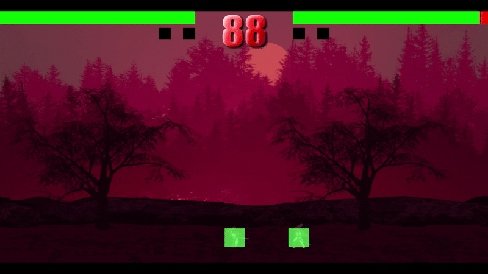

# Shadow Brawl
A simple 2D fighter made in a custom fighting game engine with local and P2P online multiplayer!

自作のエンジンで開発したシンプルな2D格闘ゲーム！ローカルとオンラインプレイも対応！

[Game-play Example](https://www.youtube.com/watch?v=pk6sew3V2ks)

# About the engine / エンジンについて
Rendering is handled by SDL3 bindings for rust, but game physics, animations, and input parsing are all custom implementations.
Player data is separated into static "Context" and mutable "State" structures, allowing for instantaneous loading of past states.

SDL3に任せたレンダリングを除いて、 フィジックスエンジン・アニメーション・入力パーシングなどが独自実装だ。
プレイヤーデータが変更する「コンテキスト」とスタティックな「ステート」に分けられて、即座に過去ステートに巻き戻すことができる。

## Fast Iteration Friendly / コンパイラが必要ない
Because all character moves and states are serialized in a config file, they can be easily changed and customized without requiring
recompilation.

キャラクターの必殺技や可能なステートがデータで保存して、コンフィグファイルから読み取られるため、コンパイラせずに変更することができる。

### Attack Example / 攻撃の一例
```
{
	"name": "medium_attack",
	"input": {"Direction": {"dir": {"type" : "Any"}, "button": {"type" : "M"}}},
	"hit_boxes": [
		{"frame": 0, "boxes": []},
		{"frame": 10, "boxes":
			[
			{
				"rect": {"x": 60, "y": 10, "w": 120, "h": 60},
				"dmg": 60,
				"block_stun": 12,
				"hit_stun": 20,
				"cancel_window": 10,
				"block_type": {"type": "Mid"}
			}
			]
		},
		{"frame": 14, "boxes":
			[
			{
				"rect": {"x": 20, "y": 10, "w": 40, "h": 60},
				"dmg": 60,
				"block_stun": 12,
				"hit_stun": 20,
				"cancel_window": 10,
				"block_type": {"type": "Mid"}
			}
			]
		},
		{"frame": 16, "boxes": []}
	],
	"hurt_boxes": [
		{"frame": 0, "boxes": [{"rect": {"x": 0, "y": 0, "w": 40, "h": 40}}]}
	],
	"collision_box": {"rect": {"x": 0, "y": 0, "w": 40, "h": 40}},

	"start_behavior": {"type" : "SetVel", "x": 0, "y": 0},
	"flags": [{"type": "LockSide"}],
	"end_behavior": { "type" : "OnFrameXToStateY", "x" : 30, "y" : "neutral"},
	
	"cancel_window": {"start": 10, "end": 22},
	"cancel_options": ["spin_attack", "forward_dash", "jump_forward", "jump_back", "jump"],

	"animation": {
	"texture_path": "./resources/character1/Attack2.png",
	"layout": {"type": "Horz"},
	"frames": 6,
	"w": 200,
	"h": 200
	}
}
```

## Net code / ネットコード
Games synchronize by negotiating a shared frame to start the game on. After that, the only communication is user inputs.
Local inputs are immediately used, but remote peer inputs are predicted and applied retroactively if the prediction fails.
Each frame, the current game state is captured and stored for later. If an input arrives on a past frame, the game rolls back
to before that frame and deterministically restimulates the game with that new input. This sometimes results in slight jumps or teleportation.

試合開始時に、両プレイヤーのゲーム状態（ステート）を同期させる。この初期フレームを基準に、以後の同期が行われる。
その後、ローカルとピアの入力しか送信されない。
ローカルの入力が即対応される一方、ピアの入力がまず予測され、その予測が間違った場合に訂正される。
ピアの入力が遅れて届いたら、入力前のステートに巻き戻される。
最後には、ゲームが再びシミュレートされる。予測が特に外れたときに、キャラクターが突然に動いたりすることもある。

### Rollback Example
The remote player stops moving left, but the input is delayed. The game is restimulated with the input once it arrives, causing
the player to jump back to where they should have stopped.

プレイヤーは止まったが、入力が遅れたため、キャラクターが左へ進む。届く際に、ゲームが再びシミュレートされ、止まったはずの位置に戻る。

